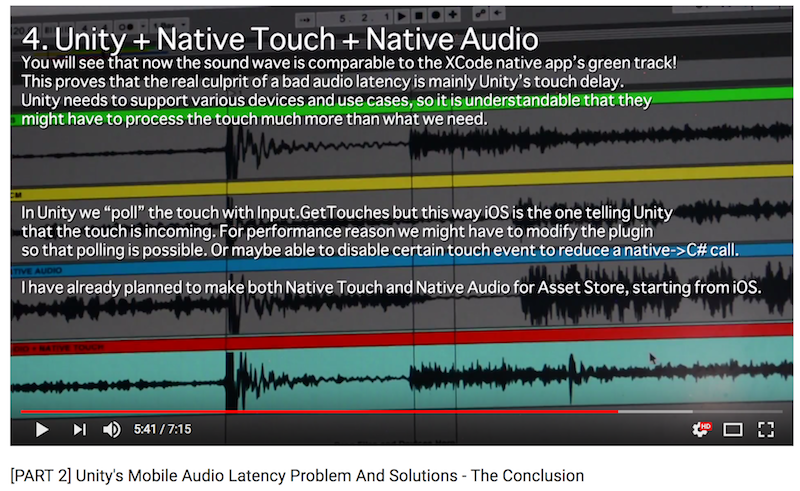

# UnityiOSNativeAudio

This Unity project is the continuation of my research [Unity's Mobile Audio Latency Problem And Solutions](http://exceed7.com/mobile-native-audio/research.html)

Previously I have made some assumptions about using OS's native method in Unity would solve the problem. In this project I show that native audio does NOT help much but rather we need a native TOUCH INPUT plugin to solve the "perceived" audio latency problem.

## Native Audio is not all of the solution, we also need Native Touch

I have written the iOS native audio plugin for use with Unity (this repo). However I was surprised that this time the average Sargon only a bit (1-5%) better than `AudioSource.Play()`. This same iPod running Sargon test with [iOSSoundTest](https://github.com/5argon/iOSSoundTest) have much lower Sargon.

But the code of iOSSoundTest and this Unity-iOS native plugin is almost the same! (Please check `Plugins/iOS/iOSNativeAudio.mm`) What else could Unity add?

You can check the result here (go to sheet 2) : https://docs.google.com/spreadsheets/d/1kSqkLM2C1NjxXg2oBcZzsVc9ooT4pZo2wSOY0Vt8C7k/edit?usp=sharing

What this means is... the perceived audio latency (the Sargon value) is bad not because Unity's audio playing ability, but it is because of Unity's input latency. The gap from my nail sound to the sound you hear is large because of input latency. The XCode's button received the touch faster than Unity's button.

## Are you sure it is because of touch?

Just in case watching the [YouTube video](https://www.youtube.com/watch?v=6Wot7lzZR5o) at the top of this page does not convince you enough, I have double check this in Unity with both uGUI's `EventSystem` and `Input.GetTouch`. Both results in the same Sargon.

I have triple check the new assumption with the second scene "Visual" which has a coroutine that call any method every 1 second. (No input latency involved) Everytime it will change the font's color from red to white and vice versa. Without nail's sound to measure, I run this and use a separate DSLR camera with 60 fps to capture the screen along with the sound, finally use Premiere Pro to examine the period between the font changing color to the peak of the sound. That would be exactly Unity's audio latency, which the result is 3-4 frames for both native iOS audio plugin and Unity's `AudioSource.Play` with all formats. (Native one is sometimes better, but not significant)

## Summary

The bottom line is, using both Native Audio **and Native Touch** together we can make a Unity app that reacts as fast as a native iOS app. Haven't confirmed on the Android side but I assume it might be the same.

(I didn't say I fixed the infamous Android's horrible audio latency problem with this. It is that Unity Android is somehow more horrible than native Android's already horrible latency and we can close that gap using Native Audio + Native Touch. We try to bypass anything Unity might add in exchange for more complex API usage.)

Another intepretation of this finding is that all Unity games in the market has delayed touch (as long as you get them from `Input.GetTouch`). Your device is capable of providing faster touch experience by using Native Touch.

# Plugin Release

Both plugins are planned to be on the Asset Store later after I have made sure it is working fine in my own music game Mel Cadence (http://exceed7.com/mel-cadence/). Starting from iOS side then Android. 

If you don't want to wait or don't want to pay me (😭), this project already contains the most barebone form of both Native Audio and Native Touch. You can hack your own solution starting from examples in my code if you want. Part of it utilize the result from [this research](https://github.com/5argon/UnitySendMessageEfficiencyTest) to make sure the talk back from native to C# is the fastest possible.

# Update (3/11/2017) : The state of Android

I have tested the Native Touch on Android. Unfortunately I could not get the touch to be faster than Unity ones. In fact it is a little bit slower sometimes.

The method I use I believe is the fastest way I can do to make Java talk to C#.
1. `UnityPlayer` in `UnityPlayerActivity` was replaced directly with my own sub class.
2. My subclass has a new `onTouchEvent`
3. This `onTouchEvent` did not use `UnitySendMessage` but using @FunctionalInterface to call to C#. It received this interface using Unity C#'s `AndroidJavaProxy`
4. The sound playing method in C# is further optimized to play using `AndroidJavaProxy`'s `Invoke` override to avoid ["look for c# methods matching the signature"](https://docs.unity3d.com/ScriptReference/AndroidJavaProxy.Invoke.html)
5. I am not even sending back any parameters yet, like touch coordinates, etc.

I could not think of any faster way than this. So I would like to conclude that it is pointless to use Native Touch with Unity Android. There is a chance that different device might behave differently and in fact maybe faster or even slower. (My device is Nexus 5) But I won't be including Android support in my Native Touch plugin and name it iOS Native Touch instead. One advantage that you would like Native Touch on Android is for getting [other native touch parameters](https://developer.android.com/reference/android/view/MotionEvent.html) that Unity does not provide, rather than a speed improvement.

However there is one more rather extreme way, that is you don't talk to C# at all. All the resources to determine whether Android should play audio on a particular touch or not should be completely reside in Java! Then after the hijacked touch and some ifs, we should call to Android Native Audio directly.. It will be very hardcore from game design perspective, for example how can I determine should I play "Perfect" sound or "Great" sound before sending touch to Unity? Is it even possible in the same frame?